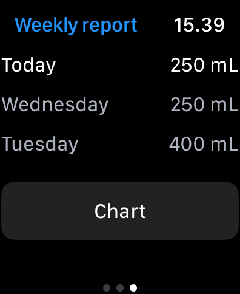

# Aqua

An iOS app to keep track of your daily water intake built with Swift.

I've always had trouble drinking enough water, so I decided to build an app to help me keep track of my daily water intake. I've been using it for a few months now and it's been working great.

You can set a daily goal and the app will keep track of how much water you've drank and how much you have left to drink. It'll send you a notification when it's time to drink more water.

It also integrates with Apple Health so you get the benefit of storing your water intake data securely in the Health app.

## Screenshots

    
    &nbsp; &nbsp;
    
    &nbsp; &nbsp;
    

    
    &nbsp; &nbsp;
    
    &nbsp; &nbsp;
    

    
    &nbsp; &nbsp;
    
    &nbsp; &nbsp;
    

    
    &nbsp; &nbsp;
    
    &nbsp; &nbsp;
    

## Widget

The app also comes with a widget that shows your daily water intake progress right on the home screen.

    

## Watch App

    
    &nbsp; &nbsp;
    
    &nbsp; &nbsp;
    

    
    &nbsp; &nbsp;
    

